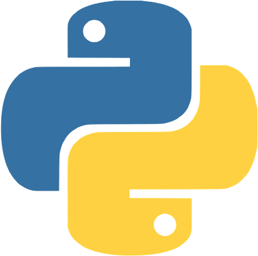
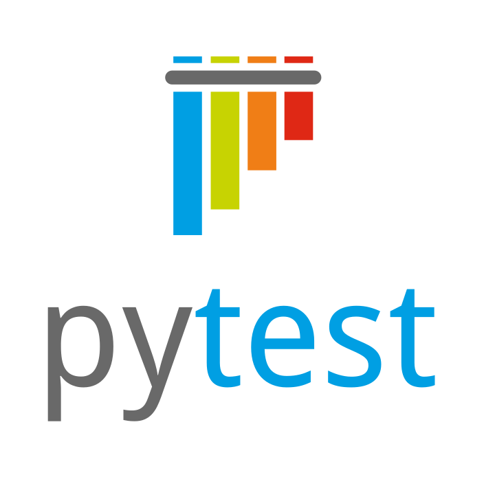
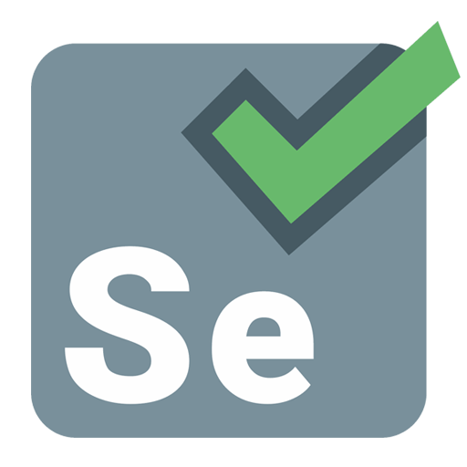
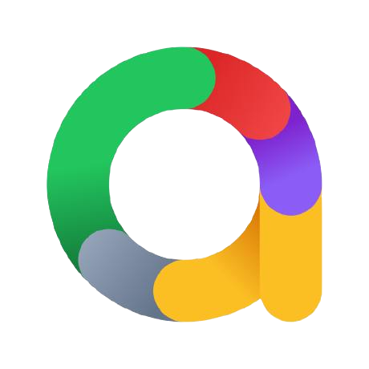
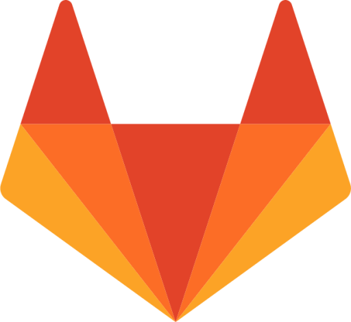

## Всем привет, я Алексей 👋
##### Middle QA 

* 🔥 5+ лет в тестировании
* 🐍 Пишу автотесты на Python
* ⚙️ Развиваюсь в автоматизации
* 📞 Мои контакты: **[телеграм](https://t.me/AKaaaa34)**, **[почта](kovalev231082@mail.ru)**

  

### Python QA Auto

#### Мой стек:
| Python | PyCharm | Git | Pytest | Requests | Selenium | Allure Report | Docker | Gitlab CI |
|--------|---------|-----|--------|----------|----------|---------------|--------|-----------|
|   |   || |  | | | | |

#### Мои проекты:
| API My Shows Rating |  API Битва покемонов | UI Битва покемонов |
|---------------------|----------------------|--------------------|
|[my-shows-api-tests](https://github.com/Kovalev231082/my-shows-api-tests)|[pokemonbattle-api-tests](https://github.com/Kovalev231082/pokemonbattle-api-tests)   | [pokemonbattle-e2e-tests](https://github.com/Kovalev231082/pokemonbattle-e2e-tests)   
| Pytest, Requests, Docker|Pytest, Requests, Gitlab CI| Selenium, Gitlab CI|

### 📚 Обучение
|||
